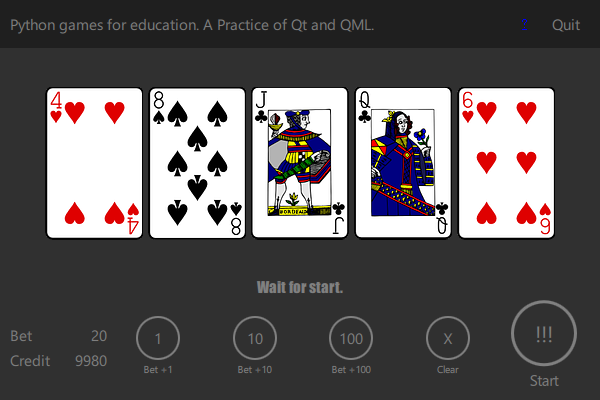

# PokerGame
Python games for education. A Practice of Qt and QML.

## This game is unfinished.
   This game lacks an implementation of testing of "poker hands".
You never win and never get a credit now. To put it concretely, lacks 2 implementation:
* class '''Hand''' lacks implementation of check() method.
* When you distinguish poker hand, increase credit in line of below tables.

Poker Hand | Probability
------------ | -------------
Royale Flush|0.000154%
Straight Flush|0.00139%
Four of a kind|0.0240%
Full House|0.1441%
Flush|0.1965%
Straight|0.3925%
Three of a kind|2.1128%
Two Pair|4.7539%
One Pair|42.2569%

## Complete QML example
  Short example of implementation of Signal, Slot, qmlRegisterType and importing qrc files.

## Pull Request is welcome.
  This repo is for education. So, your pull request of above 2 features may not be merged.

#### Author
  kou.ouchi@division-engineering.com

#### Prerequisite
  1. pyqt 5.9.2 or higher.
  2. python 3.7.6 or higher.

#### How To Run:
1. Start Command Prompt. 
2. Change current directory to this repository directory.
3. Run "Build_and_Run.bat".

#### Note
1. If you want PySide version, ping me. It's easy to convert between PySide and PyQt.
 <a href="https://twitter.com/DivisionEng/status/1327976702337642497?ref_src=twsrc%5Etfw">November 15, 2020</a></blockquote>)
2. Anaconda is the best way of setup env.

## References
1. Poker probability
https://en.wikipedia.org/wiki/Poker_probability
